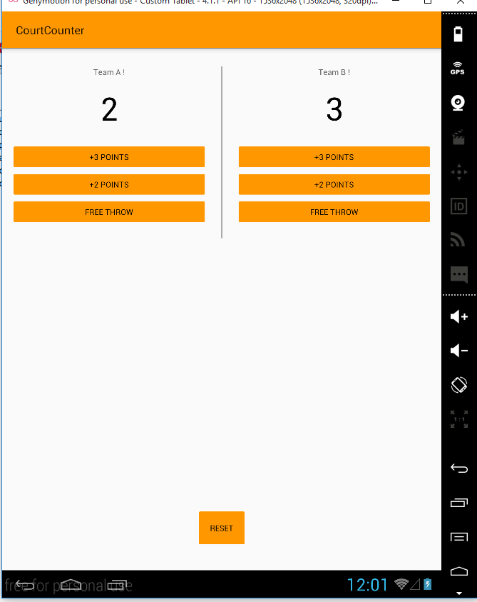

Court Counter
===================================

Keeps track of basketball scores for two teams. Used in the Udacity Android for Beginners course..

Pre-requisites
--------------

- Android SDK v23
- Android Build Tools v23.0.2
- Android Support Repository v23.3.0

Getting Started
---------------

This sample uses the Gradle build system. To build this project, use the
"gradlew build" command or use "Import Project" in Android Studio.ScreenShots
--------------

- .